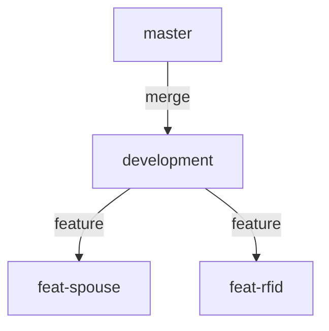

# a. Git Conventions

To navigate the repository at version control level, we make use of the following conventions and standards in Git/GitLab.

### Git Branching

Use this pattern when using Git.


### Branching Rules

- `master` branch is for production. Stable and only accepts Merge Request milestones.
- `development` is for integration branch. Acts as the middle ground before merging to master.
- `feat-*` are feature branches short-lived for new features.
- When branching out, use the convention `feat-` `dev-` `wip-` etc. use `kebab-case`.

### Archiving Branches

When a feature is finished. Make sure to archive them by tagging. Make use of tags in order to tag the branch then use it as reference for retrieving the branch.

```bash
# Archive the remote branch
git tag archive/<branchname> <branchname>

# Push the tag to remote
git push origin archive/<branchname>

# Remote branch may now be safely removed
git push origin --delete <branchname>

# Delete the local branch as well
git branch -D <branchname>
```

To retrieve that branch use:

```bash
git checkout -b <branchname> archive/<branchname>
```

---
### Creating Ticket in GitLab Issues

Document the ticket/issue by writing detail of the request.
#### Sample Ticket

> **Request**
> 
> - A redesigned feature for HRIS that integrates with ADNUONE processes.
> - Implement a leave application for employees and HR to manage.
> 
>**Functional Requirements**
> 
> - An HR can approve and disapprove filed leaves of employee.
> - An HR can create, read, update, and delete filed leaves of employees.
> - An employee may file leave based on their leave credits scheme and remaining leave credits.
> - An employee with one or more designation may have multiple immediate heads, thus, an employee may select a designation or (by default) select all designations to send copies of the leave to different immediate heads. e.g.,:
 >   - _Office of the President head receives 1 copy for review._
 >   - _Office of the Vice-President head receives 1 copy for review._
> - An employee may file leave with a duration of only whole day and half-day (AM/PM).
> - An employee may file leave with attachments based on the selected leave type. The following leave types require attachments:
>    - **Business Leave** - proof and venue
>    - **Sick Leave** - proof
>    - **Paternity/Maternity Leave** - proof
> 
>**Tasks**
> 
> - [x]  Create an ERD design for the new leave application
> - [x]  Create procedures for managing leave applications
> - [ ]  Optimize and verify the computation for leave credits
> - [ ]  Cleanup old tables e.g., `tmp_leave_application`, `leave_duration`, `leave_validity`, `leave_credit`
> - [ ]  Redesigned frontend similar to `Certificate Request`
> 
>**Nice to Have**
> 
> - Add KPIs to initial page.

### Creating Merge Requests in GitLab

When creating requests make sure to tag them through milestones. Increment them by `major`.`minor`.`patch`.

#### Sample MR

>**Changes**
>
>- Migrated old procedure to new procedure `mgt_employee_contact`.
>
>**NIT**
>
>- None.

---

➡️ Next up!

[[b. Code Conventions]]