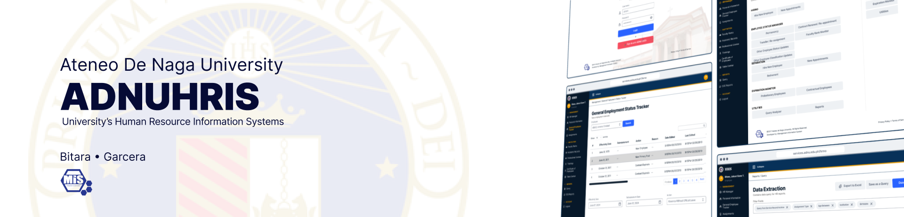

# HRIS: University's Human Resources Information System Wiki 📖.

[View Live Demo](https://services.adnu.edu.ph/hris) • [Report a Bug](https://mis-git.adnu.edu.ph/misadnu/hris/issues)

<b>Table of Contents</b>

1. [About the Project](#about)
2. [[1. Project Setup/a. Prerequisites|Prerequisites]]
3. [[Setting LAN Connection]]
4. [[c. Code Conventions|Code Conventions]]
5. [[a. Git Conventions|Git Conventions]]
6. [License](#license)
7. [Contributors](#contributors)
 

#### **About**

The HRMO currently uses separate databases and applications outside the University Integrated Information Systems (UIIS) managed by MIS. Since MIS systems also store employee records, this setup causes duplication, inaccuracy, and inconsistency. Migrating to a centralized Human Resource Information System (HRIS) will unify employee data within UIIS, streamline HRMO processes, standardize workflows, and improve data integrity.

As the university grows, the current HRMO systems may struggle with scalability and integration. A centralized HRIS ensures flexibility to meet future needs and seamless integration with other MIS-managed systems.  

**Project Objectives:**

- Consolidate all employee data into a single HRIS repository for consistency and accessibility.
- Assess and redesign HRMO workflows to improve efficiency.
- Ensure integration with other systems for scalability and interoperability.
- Create a migration and communication plan to minimize disruption and support a smooth transition.

#### **Developer Notes**

The author dedicates this page for documenting the entire codebase logic in navigating the HRIS' structure. The documentation aims to aid developers for onboarding and to reduce visual overload on where to start adding features.

By fully understanding Laravel's components and Livewire's event system design, any developer navigating through the repository should be able to make sense of the processes and find the structure simple and easy to navigate with its clean architecture approach.

#### **Technology Stack**

#### **Resources Used**

## **License**

Distributed under the MIT License. See `LICENSE` for more information.

## **Project Contributors**

-   **Sheila Mae DV. Avila** (Project Manager / Development Team Lead)
-   **Johcel Gene T. Bitara** (Application Developer)
-   **Miguel Damien L. Garcera** (Application Developer)
-   **Maria Michaela P. Lorenzo** (System Analyst/Technical Writer)
-   **Jesus SJ. Tabinas, Jr.** (Database Administrator)
-   **Ryan Jay D. Rosano** (Information Systems Administrator)

## **Documentation Author**

- **Johcel Gene T. Bitara** (Application Developer)
- genebitara@gmail.com | jbitara@gbox.adnu.edu.ph